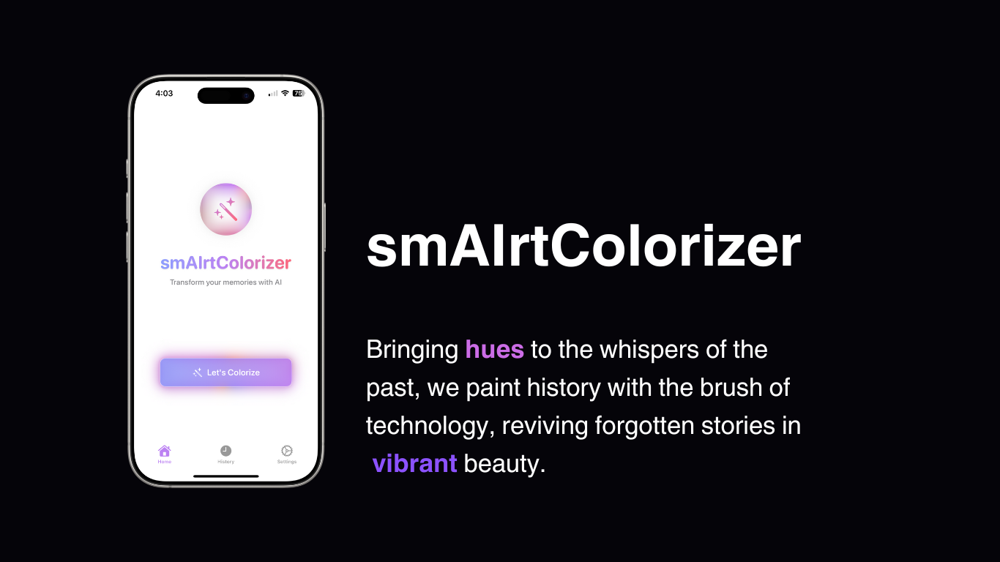
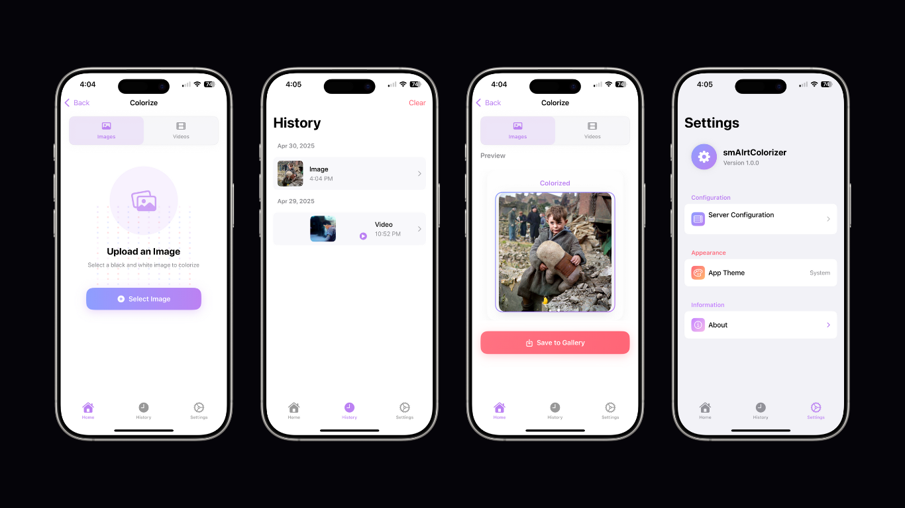

# 🪄🌈 smAIrtColorizer

This project provides an end-to-end pipeline for image and video colorization using a deep learning model. The backend is implemented in Python with Flask, while the frontend is built using Swift for iOS.



## Table of Contents
- [Features](#features)
- [Requirements](#requirements)
- [Setup](#setup)
- [Usage](#usage)
  - [Running the Backend](#running-the-backend)
  - [Running the iOS App](#running-the-ios-app)
- [Citation](#citation)
- [Acknowledgments](#acknowledgments)

---

## Features
- Colorize grayscale images and videos.
- Support for batch processing of images in a directory.
- iOS app for user-friendly interaction.
- GPU acceleration for faster processing.
- Performance metrics calculation (PSNR, SSIM).
- Multi-scale color decoder for high-quality colorization.



---

## Requirements

### Backend
- Python 3.8+
- CUDA-compatible GPU (optional for faster processing)
- Required Python libraries (see `backend/requirements.txt`):
  - Flask
  - PyTorch (>=1.7)
  - torchvision
  - OpenCV (opencv_python)
  - NumPy
  - tqdm
  - scikit-image
  - timm
  - Pillow
  - dlib
  - matplotlib
  - huggingface_hub

### iOS App
- Xcode 14+
- Swift 5.0
- iOS 15.0+

---

## Setup

### Backend
1. Clone the repository:
   ```bash
   git clone https://github.com/yourusername/smAIrtColorizer.git
   cd smAIrtColorizer/backend
   ```

2. Install the required Python libraries:
    ```bash
    pip install -r requirements.txt
    ```

3. Download the pre-trained model from the [DDColor repository](https://github.com/piddnad/DDColor) and place it in the `backend` directory. Either:
   - Rename the model file to `pretrained_model.pt`, or
   - Update the `MODEL_PATH` variable in `backend/app.py` accordingly.

4. Ensure you have a CUDA-compatible GPU for optimal performance. The application will automatically use CUDA if available.

---

### iOS App
1. Open the `ImageColorizer.xcodeproj` file in Xcode.

2. Set up your development team in the project settings for code signing.

3. Build and run the app on a simulator or a physical device.

4. When first launching the app, you'll be prompted to enter the URL of your Flask backend server.

---

## Usage

### Running the Backend
1. Start the Flask server with optional configuration parameters:
   ```bash
   # Run with default settings (host: 0.0.0.0, port: 5000)
   python app.py
   
   # Run with custom host and port
   python app.py --host 127.0.0.1 --port 8000
   
   # Specify a different model file
   python app.py --model /path/to/your/model.pt
   ```

2. The server provides the following API endpoints:
   - `/colorize`: Upload a grayscale image to colorize.
   - `/colorize-video`: Upload a grayscale video to colorize.
   - `/colorized_video.mp4`: Get a processed video after colorization.

### Using the Command Line Interface
You can also use the colorization pipeline directly from the command line:

```bash
python colorization_pipeline.py --model_path path/to/model.pth --input_file grayscale.jpg --output_file colorized.png --input_size 512
```

Options:
- `--model_path`: Path to the pre-trained model (default: 'pretrain/net_g_200000.pth')
- `--input_file`: Path to the grayscale image
- `--output_file`: Path for saving the colorized image (default: 'result.png')
- `--input_size`: Input size for the model (default: 512)
- `--model_size`: Size of DDColor model to use ('large' or 'tiny', default: 'large')

### Running the iOS App
1. Launch the app on your iOS device or simulator.

2. Configure the backend server URL:
   - Enter the IP address and port of your Flask backend server (e.g., `http://192.168.1.100:5000`)
   - For local testing with a simulator, you can use `http://localhost:5000`
   - Test the connection before proceeding

3. Use the app to upload grayscale images or videos and view the colorized results.

4. Access your colorization history through the app interface.

---

## Citation
If you use this project, please tag me and cite the original model repository 😊:

```
@inproceedings{kang2023ddcolor,
  title={DDColor: Towards Photo-Realistic Image Colorization via Dual Decoders},
  author={Kang, Xiaoyang and Yang, Tao and Ouyang, Wenqi and Ren, Peiran and Li, Lingzhi and Xie, Xuansong},
  booktitle={Proceedings of the IEEE/CVF International Conference on Computer Vision},
  pages={328--338},
  year={2023}
}
```

---

## Acknowledgments
This project uses the DDColor model from the [DDColor repository](https://github.com/piddnad/DDColor). Special thanks to the authors for providing the pre-trained model and architecture.

